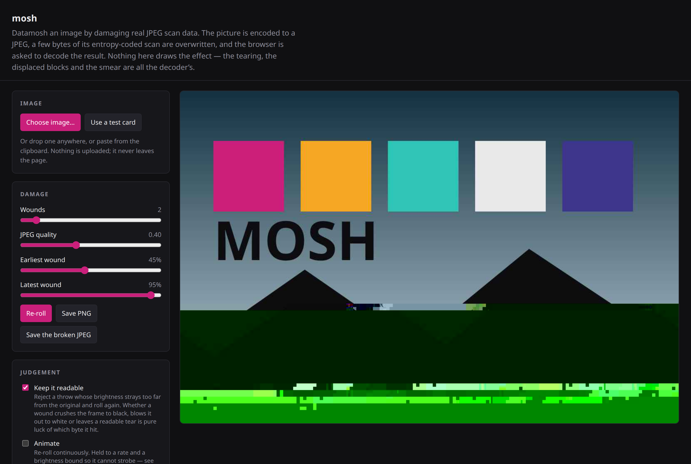

# mosh

Datamosh an image by damaging real JPEG scan data, in the browser.

**[Try it](https://tokyodaninjapan.github.io/mosh/)**

[](https://tokyodaninjapan.github.io/mosh/)

Or open `index.html` from a clone. There is no build, no server and no dependencies. Double-clicking the file works,
which is why this is a classic script rather than a module. Drop in an image, paste one, or use the test card. Nothing
is uploaded. The picture never leaves the page.

## What it actually does

Nothing here draws an effect. The library encodes the picture to a JPEG, overwrites a few bytes of the entropy-coded
scan, and asks the browser to decode the result. The torn rows, the sideways-displaced blocks and the colour smeared to
the right edge are all what a decoder does when the bit stream stops matching what the decoder expects.

Two properties of the format do all of the work. You cannot imitate either one by drawing blocks by hand.

- **The entropy-coded data is a bit stream, not an array of blocks.** Damage a byte and the Huffman decoder loses its
  place. Every later block is read at the wrong bit offset, so the rest of the row — often the rest of the image —
  arrives shifted, torn or as noise.
- **DC coefficients are stored as differences.** Each block's brightness is a difference from the block before it, so
  one wrong DC value passes to every block downstream. That inheritance is the long horizontal smear, and it is why the
  damage runs to the edge instead of staying where it started.

This distinction matters, because people also use 'JPEG glitch' for a quite different technique. That technique abuses
the _encoder_ with a deliberately wrong quantisation table, as in
[freder's jpeg-glitch notebook](https://github.com/freder/jpeg-glitch-notebook). It gives blocking, ringing and banding.
It does not give smears or displaced blocks, because nothing has lost sync. For that look, change the quantisation. For
this one, you need a real round trip.

## What must never be damaged

Damage any of these and you get no picture at all, rather than a broken one:

- **Anything before the scan.** The tables and the frame header say how to read what follows.
- **Any `0xFF` byte, and any byte directly after one.** `0xFF` begins a marker, and inside the scan a stuffed `0x00`
  follows it. Overwrite either byte and you can invent an end-of-image marker, which truncates the picture, or destroy a
  restart marker.
- **Never write `0xFF`**, for the same reason.

`scanStart` walks the marker segments rather than searching for the `FF DA` pair. The two methods look equivalent and
are not. Those two bytes occur inside quantisation tables and Huffman tables by coincidence often enough to matter. A
false hit puts the damage in the tables, and the result is not a glitched picture but no picture.

A decoder is still free to give up, and Chrome sometimes does. The library catches that failure rather than guarding
against it. A throw that will not decode is never shown, and the next throw is a fresh roll of the dice.

## Throwing the dice again

A wound can crush the frame to black, blow it out to white, or leave a readable picture with a tear across it. Which of
the three you get is pure luck of the byte the wound landed on. Nothing about the wound predicts the outcome.

So `keep` discards a throw whose mean brightness strays too far from the source, then rolls again. The cost is one
decode of a buffer that is already encoded. `keep` is the difference between a datamosh and a black rectangle, and it is
the most useful dial here. To see the raw distribution, turn off 'Keep it readable' in the demo.

## On animating it

A damaged DC value changes the brightness of every block downstream. Each re-roll can therefore swing most of the frame
between near-black and near-white. Twenty-four of those a second is a strobe, and
[WCAG 2.3.1](https://www.w3.org/WAI/WCAG22/Understanding/three-flashes-or-below-threshold.html) counts three a second as
flashing. You can bound three things to prevent the strobe, and only one of the three is free:

- **Bounding the rate** works and costs the animation. At 2.5 refreshes a second, the picture reads as stopping and then
  jumping.
- **Bounding the changing area** — clipping the damage to a band — also works, and looks wrong. The tear is the
  interesting part and the flat smear below it is not. A band lands on the smear and reads as a censor bar.
- **Bounding the change itself** costs nothing. Show a frame only if its mean brightness is close to the frame before it
  (`steady`). No two consecutive frames can then differ by more than a few per cent, however fast the frames arrive.

The demo uses `steady` _and_ a modest rate cap, because a still image gives the bound nothing to follow. With no
movement underneath, every re-roll is pure change. Over live video, the bound alone is enough. If
`prefers-reduced-motion` is set, the demo does not animate at all.

## Using mosh.js directly

`mosh.js` sets `globalThis.Mosh` and depends on nothing.

```js
const result = await Mosh.mosh(canvas, {
  quality: 0.4, // re-encode quality. Low means big, legible blocks
  wounds: 2, // how many bytes to damage, or an array from makeWound
  from: 0.45, // earliest wound, as a fraction of the scan
  to: 0.95, // latest
  keep: 26, // reject a throw straying this far in mean brightness (0 = off)
  steady: 0, // reject a throw straying this far from `previous` (0 = off)
  previous: null, // brightness of the last frame shown, for `steady`
  tries: 4, // throws before giving up
});

if (result.ok) {
  ctx.drawImage(result.bitmap, 0, 0);
  result.bitmap.close();
}
```

`mosh` resolves to a report rather than to a picture alone, so you can see what happened:
`{ ok, bitmap, bytes, scan, size, landed, tries, brightness, rejected, wounds }`. `rejected` is one of `decode`, `keep`,
`steady` or `no-scan`.

**Do not mosh your own output.** Feed each roll the original picture. Damage on top of damage compounds, and the image
decays to nothing within a few seconds. The demo keeps an untouched source canvas for this reason.

**Reuse the wounds to animate.** Pass the `wounds` array back in, and the damage keeps its position while the picture
underneath changes. Re-roll the wounds instead, and the tear leaps somewhere new every frame. A wound holds a _fraction_
of the scan rather than an index, so you can apply it to a later encoding of a different picture.

### Installing it

There is nothing to install to use the demo. To depend on it from a project, take a tag rather than a branch, so a later
change here cannot reach a build that was not asking for it:

```sh
npm install "github:TokyoDanInJapan/mosh#v1.0.0"
```

`mosh.js` is still the source, and it is still a classic script. `index.js` is a wrapper over it for bundlers: it runs
the script and republishes what the script sets on `globalThis`, so both of these give you the same object.

```js
import { mosh, makeWound } from 'mosh';
import Mosh from 'mosh';
```

The package is not on npm, and `private` is set so it cannot be pushed there by accident.

## Development

The shipped code has no dependencies. Prettier is the only development tool, and it keeps the formatting consistent:

```sh
npm install
npm run format   # rewrite the files
npm run check    # check them, as CI does
```

## Licence

MIT. See [LICENSE](LICENSE).
